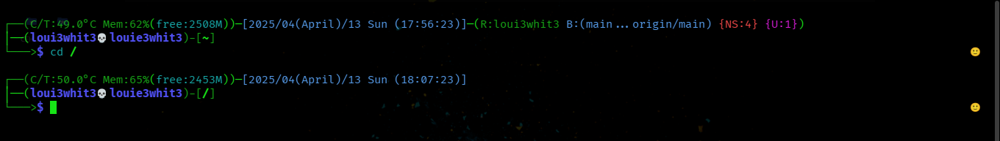
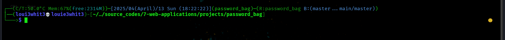
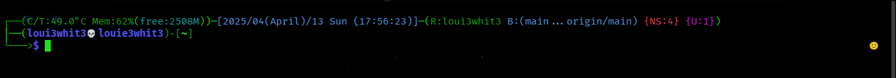
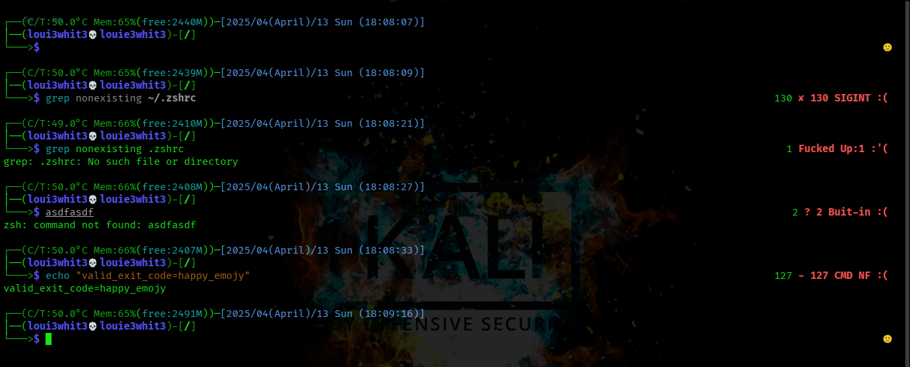
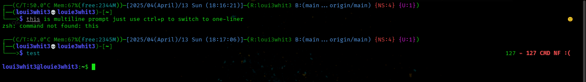

# 🔥 Arshia's ZSH Configuration (ASH) - Advanced Shell for Hackers

**My personalized ZSH setup - the way I like it!**

This is my personal ZSH configuration crafted specifically for ethical hacking and penetration testing workflows. I've published it primarily to easily clone and set up my preferred terminal environment on remote machines during engagements.

**Disclaimer:** This configuration is optimized for security professionals and includes tools/utilities that may be detected as malicious by some systems. Use responsibly and only in authorized environments.



## Table of Contents

1. [Features](#-features)
   - [Git Integration](#git-integration)
   - [Penetration Testing Tools](#penetration-testing-tools)
   - [System Monitoring](#system-monitoring)
   - [Security-focused Aliases](#security-focused-aliases)
   - [Enhanced Productivity](#enhanced-productivity)
2. [Installation](#-installation)
   - [Prerequisites](#prerequisites)
   - [Comprehensive Installation Guide](#-comprehensive-installation-guide)
     - [Option 1: User-Level Installation](#option-1-user-level-installation-recommended-for-security-work)
     - [Option 2: System-Wide Installation](#option-2-system-wide-installation)
   - [Post-Install Verification](#post-install-verification)
   - [Troubleshooting](#troubleshooting)
   - [Uninstallation](#uninstallation)
3. [Configuration](#-configuration)
   - [Prompt Customization](#-prompt-customization)
4. [Key Components](#-key-components)
5. [Security Considerations](#-security-considerations)
6. [Contributing](#-contributing)
7. [License](#-license)
8. [Acknowledgments](#acknowledgments)

---

## 🚀 Features

### Key Components
| File | Purpose |
|------|---------|
| `.zshrc` | Main configuration |
| `aliases/` | 100+ shortcuts |
| `functions/` | Pentest utilities |
| `prompt/` | Custom prompt logic |

### Git Integration
- **Advanced async Git prompt** showing:
  - Repository name
  - Current branch
  - Ahead/Behind status
  - Untracked and unstaged changes
- **Comprehensive set of Git aliases and functions** including:
  - `gacp` - Add, commit, and push with one command
  - `gsquash` - Interactive squash commits
  - `gcleanup-merged` - Clean up merged branches
  - `gvuln-note` - Create vulnerability tracking branches
  - ...and many more (over 50 Git utilities)

### Penetration Testing Tools
- **Custom functions** for common pentest tasks:
  - `pentest-report` - Generate formatted penetration test reports
  - `zonetrans` - Check for DNS zone transfers
  - `mirror_website_agr` - Aggressive website mirroring
  - `extract_http_dorks` - Extract Google Dork results
  - Vulnerability scanning helpers

### System Monitoring
- **Real-time system stats** in prompt:
  - Memory usage with color-coded warnings
  - CPU temperature monitoring
  - Virtualization detection

### Security-focused Aliases
Quick access to security tools:
```bash
alias nfast="nmap -T4 -F"
alias nfull="nmap -T4 -p-"
alias nscript="nmap --script=vuln"
alias nssl="nmap -p 443 --script=ssl-enum-ciphers"
```

### Enhanced Productivity
- Smart directory navigation aliases
- Text processing utilities
- System monitoring tools
- Virtual environment management
- **Hacker-optimized prompt** with:
  - Async Git status monitoring
  - System resource monitoring (RAM, CPU temp)
  - Virtual environment awareness
  - Exit code handling with security-specific codes
- **Penetration testing utilities**:
  - Website mirroring functions
  - Vulnerability note-taking
  - ExploitDB syncing
  - Dork extraction
- **Git superpowers**:
  - 100+ Git aliases and functions
  - Branch management utilities
  - Vulnerability tracking workflows
- **Shell analysis tools**:
  - Statistical analysis functions
  - Data processing utilities
  - Frequency counting

---
## auto installation with script
### Locally installation

```bash
curl -fsSL https://raw.githubusercontent.com/a-mashhoor/myzsh/refs/heads/main/.zshrc | sudo bash -s -- -u
```
### Globally installation
```bash
curl -fsSL https://raw.githubusercontent.com/a-mashhoor/myzsh/refs/heads/main/.zshrc | sudo bash -s -- -g

```
---
## 🔧 Pre-Install Requirements

For **full functionality** (especially pentesting features), install these tools first:

### 1. Core Dependencies
```bash
# Debian/Ubuntu/Kali
sudo apt install -y \
  git curl wget lynx nmap dnsutils procps lm-sensors \
  python3 python3-pip jq ripgrep less tree

# Arch Linux
sudo pacman -S --needed \
  git curl wget lynx nmap bind-tools procps-ng lm_sensors \
  python python-pip jq ripgrep less tree

# macOS (Homebrew)
brew install \
  git curl wget lynx nmap bind jq ripgrep less tree \
  python lm-sensors
```

### 2. Hardware Sensors *(For CPU/RAM monitoring in prompt)*
```bash
# Linux sensors (required for CPU temp display)
sudo apt install lm-sensors  # Debian
sudo pacman -S lm_sensors   # Arch
sudo sensors-detect         # Run detection (answer YES to all)
```

### 3. Penetration Testing Tools
*(Optional but recommended for full feature set)*
```bash
# Recon
sudo apt install -y \
  exploitdb gobuster dirbuster nikto sqlmap \
  net-tools whois netcat-openbsd

# Analysis
pip3 install --user \
  pygments bs4 lxml requests

# Git-based tools (auto-updated via `gsync-exploits`)
git clone https://github.com/offensive-security/exploitdb.git ~/tools/exploitdb
ln -s ~/tools/exploitdb/searchsploit /usr/local/bin/searchsploit
```

### 4. ZSH Plugins
*(Auto-installed, but manual if needed)*
```bash
# Syntax Highlighting
git clone https://github.com/zsh-users/zsh-syntax-highlighting.git \
  ~/.zsh/plugins/zsh-syntax-highlighting

# Auto-Suggestions
git clone https://github.com/zsh-users/zsh-autosuggestions \
  ~/.zsh/plugins/zsh-autosuggestions
```

### 5. Fonts *(For prompt icons)*
- Install a [Nerd Font](https://www.nerdfonts.com/) (e.g., FiraCode, Hack)
  ```bash
  # Linux
  mkdir -p ~/.fonts && cd ~/.fonts
  wget https://github.com/ryanoasis/nerd-fonts/releases/download/v3.0.2/FiraCode.zip
  unzip FiraCode.zip && fc-cache -fv

  # macOS
  brew tap homebrew/cask-fonts
  brew install --cask font-fira-code-nerd-font
  ```

---

### Post-Install Verification
Check if critical tools are detected:
```bash
# Sensors
sensors | grep "Package id" || echo "⚠ CPU temp monitoring disabled (no sensors)"

# Pen-test tools
command -v nmap &>/dev/null || echo "⚠ Nmap not installed (scan functions limited)"
command -v rg &>/dev/null || echo "⚠ Ripgrep missing (fast grep disabled)"
```

---

## 🛠 Comprehensive Installation Guide

### Option 1: User-Level Installation (Recommended for Security Work)
*Only affects your user account. Safer for shared systems.*

#### 1. Install ZSH
```bash
# Debian/Ubuntu/Kali
sudo apt update && sudo apt install -y zsh zsh-syntax-highlighting zsh-autosuggestions

# Arch Linux
sudo pacman -S zsh zsh-syntax-highlighting zsh-autosuggestions

# Fedora
sudo dnf install zsh zsh-syntax-highlighting zsh-autosuggestions

# macOS (Homebrew)
brew install zsh zsh-syntax-highlighting zsh-autosuggestions
```

#### 2. Clone This Repo
```bash
git clone https://github.com/a-mashhoor/myzsh.git ~/.zsh-config
```

#### 3. Update ZSH Async Plugin *(Latest Version)*
```bash
rm -rf ~/.zsh-config/.zsh/plugins/async
git clone https://github.com/mafredri/zsh-async ~/.zsh-config/.zsh/plugins/async
```

#### 4. Symlink Configuration
```bash
mv ~/.zshrc ~/.zshrc.bak  # Backup existing config
ln -s ~/.zsh-config/.zshrc ~/.zshrc

# Symlink directories
mkdir -p ~/.zsh
for dir in aliases functions plugins prompt; do
  ln -s ~/.zsh-config/.zsh/$dir ~/.zsh/$dir
done
```

#### 5. Set ZSH as Default Shell
```bash
chsh -s $(which zsh)
```
*Log out and back in for changes to take effect.*

---

### Option 2: System-Wide Installation
*For security teams or shared workstations. Requires root.*

#### 1. Install Dependencies (as root)
```bash
sudo apt update && sudo apt install -y zsh zsh-syntax-highlighting zsh-autosuggestions
```

#### 2. Clone to Global Location
```bash
sudo git clone https://github.com/a-mashhoor/myzsh.git /etc/zsh-config
```

#### 3. Update Async Plugin Globally
```bash
sudo rm -rf /etc/zsh-config/.zsh/plugins/async
sudo git clone https://github.com/mafredri/zsh-async /etc/zsh-config/.zsh/plugins/async
```

#### 4. Deploy System-Wide
```bash
# Backup existing configs
sudo mv /etc/zsh/zshrc /etc/zsh/zshrc.bak

# Symlink to global ZSH directory
sudo ln -s /etc/zsh-config/.zshrc /etc/zsh/zshrc
sudo mkdir -p /etc/zsh
for dir in aliases functions plugins prompt; do
  sudo ln -s /etc/zsh-config/.zsh/$dir /etc/zsh/$dir
done
```

#### 5. Set as Default Shell for All Users
```bash
sudo sed -i 's|/bin/bash|/usr/bin/zsh|g' /etc/passwd  # WARNING: Affects ALL users
```
*Alternatively, set per-user with `sudo chsh -s $(which zsh) username`*

---

### Post-Install Verification
1. Start a new terminal session.
2. Verify with:
   ```bash
   echo $SHELL  # Should show /bin/zsh or /usr/bin/zsh
   zsh --version  # Confirm ZSH is active
   ```
3. Test features:
   ```bash
   alias | grep '^g'  # Check Git aliases
   pentest-report example.com  # Verify pen-test functions
   ```

---

### Troubleshooting
| Issue | Solution |
|-------|----------|
| `async.zsh not found` | Re-run plugin update step |
| Permission denied | Use `sudo` for system-wide or fix user permissions |
| Prompt not loading | Check symlinks exist with `ls -la ~/.zsh*` |

---

### Uninstallation
**User-Level:**
```bash
rm -rf ~/.zsh-config ~/.zshrc ~/.zsh
chsh -s $(which bash)  # Revert to bash
```

**System-Wide:**
```bash
sudo rm -rf /etc/zsh-config /etc/zsh
sudo sed -i 's|/usr/bin/zsh|/bin/bash|g' /etc/passwd
```

---

## 🎨 Prompt Customization

The prompt adapts to your context:
- Changes color when in virtualenv
- Shows Git repo status asynchronously
- Displays system stats (CPU/Temp (C/T) is hidden in VMs)
- Color-codes exit status for common pentest tools

**Virtualenv Example:**


**Git Info Example:**


**Exit Codes Example:**


Toggle between modes with `Ctrl+P`:
- Multi-line (default)
- Single-line (for small terminals)

**One-Liner Example:**


---

## 🔒 Security Considerations

This configuration includes utilities useful for:
- Vulnerability research
- Bug bounty hunting
- Penetration testing
- Security automation

**Note:** Some functions like `mirror_website_agr` should only be used against authorized targets.

---

## 🤝 Contributing

While this is primarily my personal config, I welcome:
- Bug reports
- Security improvements
- Performance optimizations

**Guidelines**:
1. Open an issue before major changes
2. Keep pentest tools well-documented
3. Maintain backward compatibility

---

## 📜 License

MIT License - see [LICENSE](./LICENSE) for details.

---

**Maintainer**: Arshia Mashhoor
*"Tools shape the craftsman"* - Security Proverb

## 🙏 Acknowledgments

- [zsh-async](https://github.com/mafredri/zsh-async) for asynchronous prompt updates
- [zsh-syntax-highlighting](https://github.com/zsh-users/zsh-syntax-highlighting) for command highlighting
- [bash-analysis](https://github.com/bahamas10/bash-analysis) for text processing functions
- [kali-linux](https://www.kali.org/) I started modifying their configs so special thanks to them!

*"Know your tools as well as you know your targets."* - Unknown hacker
